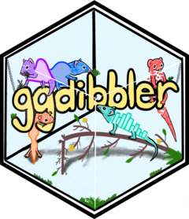

<!-- README.md is generated from README.Rmd. Please edit that file -->

```{r, include = FALSE}
knitr::opts_chunk$set(
  collapse = TRUE,
  comment = "#>",
  fig.path = "man/figures/README-",
  out.width = "100%"
)
```

# `ggdibbler` 

For information to be passed into ggplot2, or any visualisation software, it usually needs to be expressed as data. This restriction prevents us from visualising inputs that are too uncertain to be expressed as single data values. This can include things like estimates, model predictions, bounded values or observations with large measurement error. 

Now, users can simply replace a vector of data with a vector of random variables created using [`distributional`](https://github.com/mitchelloharawild/distributional) and visualise these types of inputs using `ggdibbler`. Any quantifiable uncertainty can be expressed as a distribution, and any distribution can be passed to an existing `ggplot2` geom with `ggdibbler`. Users are not limited by data type, the data can be continuous or discrete, sf objects, character or factors, or even other distributions. You are also not limited to any type of distribution, theoretical, empirical, truncated, and mixed distributions are all allowed by `distributional` and therefore accepted by `ggdibbler`. No matter what you pass, `ggdibbler` will incorporate the uncertainty into your graphic as noise and allows you to see how the variation may change the conclusions you take away from your graphics. 

The power of `ggdibbler` is in its simplicity and flexibility. There is no need to learn specific package syntax or new functions and you can pass a distribution to ANY combination of aesthetics in ggplot2. It is a universal, exploratory tool for uncertainty visualisation.

## Installation

You can install the stable version of `ggdibbler` from CRAN with:

``` r 
# install.packages("pak")
install.packages("ggdibbler")
```

or you can install the development version of `ggdibbler` from [GitHub](https://github.com/) with:

``` r
# install.packages("pak")
pak::pak("harriet-mason/ggdibbler")
```

## Examples
In essence, `ggdibbler` makes visualising uncertainty easy, as you just replace the `geom_*` with `geom_*_sample` and replace your deterministic variable with a `distributional` variable, and you get an uncertainty visualisation. 

You will often run into an overplotting problem when visualising uncertainty, so using a jitter or adjusting the alpha value will allow you to see all outcomes of the distribution. Otherwise you will only see the final draw.

Below are some examples of `ggdibbler` code alongside their uncertain `ggplot2` counterpart. The only parameters added by `ggdibbler` are the `times` argument, which decides how many samples to draw from the distribution, and the `seed` argument which allows you to keep the same random draw across multiple layers.

```{r, message=FALSE, warning=FALSE}
library(distributional)
library(dplyr)
library(sf)
library(ggplot2)
library(ggdibbler)
library(patchwork)

set.seed(1343)
```

```{r, fig.width=8, fig.height=4}
p1 <- ggplot(faithfuld, aes(waiting, eruptions, z = density)) + 
  ggtitle("ggplot2") +
  geom_contour()

p2 <- ggplot(uncertain_faithfuld, aes(waiting, eruptions, z = density0))+
  ggtitle("ggdibbler") +
  geom_contour_sample(alpha=0.2)

p1 + p2
```

Overlapping positions in other geom can be fixed with standard position adjustments, such as `position = "identity_dodge"` where the position of the original plot is an `identity`, and the position adjustment specific to the draws is a `dodge`.


```{r, fig.width=8, fig.height=4}

p1 <- ggplot(faithfuld, aes(waiting, eruptions)) + 
  geom_raster(aes(fill = density)) +
  ggtitle("ggplot2")+
  theme(legend.position = "bottom")

p2 <- ggplot(uncertain_faithfuld, aes(waiting, eruptions)) + 
  geom_raster_sample(aes(fill = density)) +
  ggtitle("ggdibbler some error")+
  theme(legend.position = "bottom")

p3 <- ggplot(uncertain_faithfuld, aes(waiting, eruptions)) + 
  geom_raster_sample(aes(fill = density2)) +
  ggtitle("ggdibbler more error")+
  theme(legend.position = "bottom")

p1  + p2 + p3
```

You can mix and match positions to get some interesting looking graphics that all converge to the same `ggplot2` plot.

```{r, fig.width=12, fig.height=4}
p1 <- ggplot(mpg, aes(class)) + 
  geom_bar_sample(aes(fill = drv), 
                  position = "stack")+
  theme(legend.position="none")+
  ggtitle("stack")


p2 <- ggplot(uncertain_mpg, aes(class)) + 
  geom_bar_sample(aes(fill = drv), alpha=0.15,
                  position = "stack_identity")+
  theme(legend.position="none")+
  ggtitle("stack_identity")

p3 <- ggplot(uncertain_mpg, aes(class)) + 
  geom_bar_sample(aes(fill = drv),
                  position = "stack_dodge")+
  theme(legend.position="none")+
  ggtitle("stack_dodge")

p1 | p2 | p3
```

The only geoms that implement new positioning (i.e. not nested versions of existing `ggplot2` positions) are `geom_sf_sample`, and `geom_pollygon_sample`. These geometries use the `subdivide` position which is inspired by the pixel map implemented in [Vizumap](https://github.com/lydialucchesi/Vizumap).


```{r, fig.width=8, fig.height=4}
# Make average summary of data
toy_temp_mean <- toy_temp |> 
  dplyr::group_by(county_name) |>
  summarise(temp_mean = mean(recorded_temp))

# plot it
p1 <- ggplot(toy_temp_mean) +
  geom_sf(aes(geometry=county_geometry, fill=temp_mean), linewidth=0.7) +
  scale_fill_distiller(palette = "OrRd") +
  labs(fill="temp")+
  ggtitle("ggplot2")+
  theme(legend.position = "bottom")

# sample map
p2 <- toy_temp_dist |> 
  ggplot() + 
  geom_sf_sample(aes(geometry = county_geometry, fill=temp_dist), linewidth=0, times=50) + 
  geom_sf(aes(geometry = county_geometry), fill=NA, linewidth=0.7) +
  scale_fill_distiller(palette = "OrRd") +
  labs(fill="temp")+
  ggtitle("ggdibbler")+
  theme(legend.position = "bottom")

p1+p2
```

## Limitations of the Package
There are three primary limitations of the software to keep in mind. First, it only allows you to visualise the distribution as a sample. We are planning to expand this to quantiles in later versions but it is not currently an option. Second, if multiple distributions are passed, they are assumed to be independent. This is actually not as much of a limitation as people think, there are often a simple work around in most cases, but it isn't as frictionless as we would like. Finally, all desired scale and position functions are not always available as we built the minimum required level of nesting before this release. This is another feature we hope to build up in the future.

## Future additions to the package
Future plans for `ggdibbler` are tracked in the [Github issues](https://github.com/harriet-mason/ggdibbler/issues). If you have a suggestion or bug, please let us know!

```{r, include=FALSE, eval=FALSE}
library(spelling)
qmd <- "README.Rmd"
check_spelling <- spell_check_files(
  qmd,
  lang = "en_GB"
)
if (nrow(check_spelling) > 0) {
  print(check_spelling)
  stop("Check spelling in Qmd files!")
}
```
