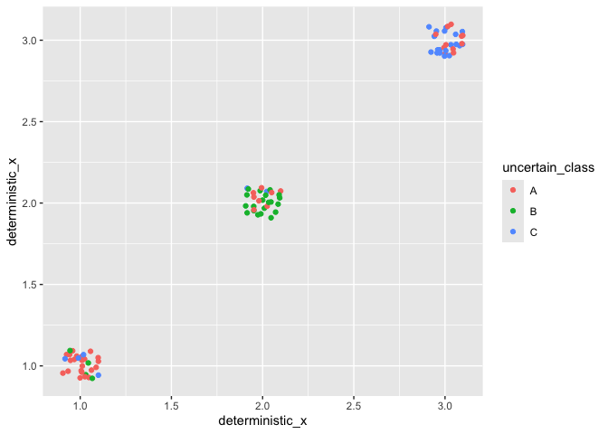

<!-- README.md is generated from README.Rmd. Please edit that file -->

# `ggdibbler` 

For information to be passed into `ggplot2`, or any visualisation
software, it usually needs to be expressed as data. This restriction
prevents us from visualising inputs that are too uncertain to be
expressed as single data values. This can include things like estimates,
model predictions, bounded values or observations with large measurement
error. While there is a wealth of visualisation software designed to
address this problem, these solutions are often limited to specific
plots or data types with bespoke syntax. The lack of generality has
significantly restricted the adoption of uncertainty visualisation by
the broader statistics community, and established uncertainty as
something to be ignored.

This problem is alleviated by `ggdibbler`. Now, users can simply replace
a vector of data with a vector of random variables created using
[`distributional`](https://github.com/mitchelloharawild/distributional)
and visualise these types of inputs using the software. Any quantifiable
uncertainty can be expressed as a distribution, and any distribution can
be passed to an existing `ggplot2` geom with `ggdibbler`. Unlike other
visualisation approaches, users are not limited by data type. You can
pass continuous, discrete, spatial (i.e. sf objects), characters,
factors, or even other distributions to `ggdibbler`. Users are also free
to pass any type of distribution to the software. Theoretical,
empirical, truncated, and mixed distributions are all allowed by
`distributional` and therefore accepted by `ggdibbler`. No matter what
you pass, `ggdibbler` will incorporate the uncertainty into your graphic
as noise and allows you to see how the variation changes the conclusions
you take away from your graphics.

The power of `ggdibbler` is in its simplicity and flexibility. There is
no need to learn specific package syntax or new functions and you can
pass a distribution to ANY combination of aesthetics in `ggplot2`. It is
a universal, exploratory tool for uncertainty visualisation.

## Installation

You can install the stable version of `ggdibbler` from CRAN with:

``` r
install.packages("ggdibbler")
```

or you can install the development version of `ggdibbler` from
[GitHub](https://github.com/) with:

``` r
# install.packages("pak")
pak::pak("harriet-mason/ggdibbler")
```

## Examples

To make a `ggdibbler` visualisation you just replace a `geom_*` function
from `ggplot2` with `geom_*_sample`, and replace your deterministic
variable with a `distributional` variable, and you get an uncertainty
visualisation. It is that simple.

You will often run into an over plotting problem when visualising
uncertainty, so using a jitter or adjusting the alpha value will allow
you to see all outcomes (rather than just the final draw). In many cases
the over plotting is managed automatically with the nested positioning
system (such as in `geom_sf` or `geom_tile`), but it is still a good
idea to always set `alpha < 1` when making a plot for the first time to
ensure you aren’t accidentally obfuscating some of the outcomes.

Below are some examples of uncertain `ggdibbler` plots alongside their
deterministic `ggplot2` counterpart. The only parameters added by
`ggdibbler` are the `times` argument (which decides how many samples to
draw from the distribution), and the `seed` argument (which allows you
to keep the same random draw across multiple layers). Otherwise, the
parameters and syntax are identical to that of a standard `ggplot`.

``` r
library(distributional)
library(dplyr)
library(sf)
library(ggplot2)
library(ggdibbler)
library(patchwork)

set.seed(1343)
```

``` r
p1 <- ggplot(faithfuld, aes(waiting, eruptions, z = density)) + 
  ggtitle("ggplot2") +
  geom_contour()

p2 <- ggplot(uncertain_faithfuld, aes(waiting, eruptions, z = density0))+
  ggtitle("ggdibbler") +
  geom_contour_sample(alpha=0.2)

p1 + p2
```


This raster plot below provides an example of the nested position system
implemented in `ggdibbler`. By default a raster plot will have it’s
position set to `position = "identity_dodge"` where the position
associated with the original (i.e. `ggplot2` version) of the plot is an
`identity`, and the position adjustment specific to the draws is a
`dodge`.

``` r

p1 <- ggplot(faithfuld, aes(waiting, eruptions)) + 
  geom_raster(aes(fill = density)) +
  ggtitle("ggplot2")+
  theme(legend.position = "bottom")

p2 <- ggplot(uncertain_faithfuld, aes(waiting, eruptions)) + 
  geom_raster_sample(aes(fill = density)) +
  ggtitle("ggdibbler some error")+
  theme(legend.position = "bottom")

p3 <- ggplot(uncertain_faithfuld, aes(waiting, eruptions)) + 
  geom_raster_sample(aes(fill = density2)) +
  ggtitle("ggdibbler more error")+
  theme(legend.position = "bottom")

p1  + p2 + p3
```


You can mix and match positions to get some interesting looking graphics
that all converge to the same `ggplot2` plot as the variance approaches
zero.

``` r
p1 <- ggplot(mpg, aes(class)) + 
  geom_bar_sample(aes(fill = drv), 
                  position = "stack")+
  theme(legend.position="none")+
  ggtitle("stack")


p2 <- ggplot(uncertain_mpg, aes(class)) + 
  geom_bar_sample(aes(fill = drv), alpha=0.15,
                  position = "stack_identity")+
  theme(legend.position="none")+
  ggtitle("stack_identity")

p3 <- ggplot(uncertain_mpg, aes(class)) + 
  geom_bar_sample(aes(fill = drv),
                  position = "stack_dodge")+
  theme(legend.position="none")+
  ggtitle("stack_dodge")

p1 | p2 | p3
```


The only geoms that implement new positioning (i.e. not nested versions
of existing `ggplot2` positions) are `geom_sf_sample`, and
`geom_pollygon_sample`. These geometries use the `subdivide` position
which is inspired by the pixel map implemented in
[Vizumap](https://github.com/lydialucchesi/Vizumap).

``` r
# Make average summary of data
toy_temp_mean <- toy_temp |> 
  dplyr::group_by(county_name) |>
  summarise(temp_mean = mean(recorded_temp))

# plot it
p1 <- ggplot(toy_temp_mean) +
  geom_sf(aes(geometry=county_geometry, fill=temp_mean), linewidth=0.7) +
  scale_fill_distiller(palette = "OrRd") +
  labs(fill="temp")+
  ggtitle("ggplot2")+
  theme(legend.position = "bottom")

# sample map
p2 <- toy_temp_dist |> 
  ggplot() + 
  geom_sf_sample(aes(geometry = county_geometry, fill=temp_dist), linewidth=0, times=50) + 
  geom_sf(aes(geometry = county_geometry), fill=NA, linewidth=0.7) +
  scale_fill_distiller(palette = "OrRd") +
  labs(fill="temp")+
  ggtitle("ggdibbler")+
  theme(legend.position = "bottom")

p1+p2
```



## Limitations and future additions to the package

There are some limitations to the software that are important to keep in
mind. First, it only allows you to visualise the distribution as a
sample. This does not prevent us from fully see the distribution in
full, as the sample approaches the mass as the `times` argument
approaches infinity, but increasing the `times` argument can become
computationally expensive. Second, if multiple distributions are passed,
they are assumed to be independent. Finally, the full set of nested
scale and nested positions are not yet available in `ggdibbler`, so all
it is not possible to make `ggdibbler` versions of all plots that use a
position adjustment. We built the minimum level of nesting required to
replicate the examples from the `ggplot2` documentation. We plan to fix
several of these limitations in future releases of the package

Future plans for `ggdibbler` are tracked in the [Github
issues](https://github.com/harriet-mason/ggdibbler/issues). There you
can see the upcoming additions to the package, including integration
with the `ggplot2` extension ecosystem, the ability to pass joint
distributions as parameters, and a full implementation of the nested
position and scale systems. We are always open to suggestions, so if you
have noticed a bug or would like to request a feature, please let us
know!
