# Get started with ggdibbler

### TLDR - What is `ggdibbler`?

You can pass random variables to ggplot now. Any geom, any aesthetic
(except groups and facets), they all accept random variables. we make no
judgements on your plot, we am not your rulers. Whatever your plot is,
`ggdibbler` will allow you to pass a random variable to it. The rest of
the vignette will explain how this works and the philosophy behind it. I
know you are itching to get to the package, so I will quickly answer the
main question I know you are dying to ask: Yes, I DO accept cash gifts
as expressions of gratitude, cheers.

## The unfamiliar stuff

This is a brief explanation of the things you might not already be
familiar with when learning about `ggdibbler`.

### Using distributional

`ggdibbler` is entirely built upon the R package `distributional` which
allows you to store distributions in a data frame as distribution
objects. The package is the foundation of `ggdibbler` because it
perfectly embodies the concept of a random variable as a unit. The
package is also shockingly flexible and I am yet to come across a case
that cannot be represented by `distributional`. If you have uncertainty
that can quantified then it can be represented in a vector and therefore
can be visualised by `ggdibbler`.

- Bounded values? use `dist_uniform(lowerbound, upperbound)`
- Uncertain predicted classes? use `dist_categorical`
- Want to sample values from a specific vector of values (such as a
  posterior)? use `dist_sample`
- Classic empirical distribution? Go buck wild with `dist_normal`,
  `dist_poission`, and the like

There are also flexibilities that go beyond just the distribution you
choose.

- You can transform distributions using standard arithmetic (in sensible
  situations) or with `dist_transformed`
- You can make mixed distributions using `dist_mixture` and truncate
  distributions with `dist_truncated`
- You can make your own bespoke distributions (although I am not sure
  how difficult that is, I have never had to do it).
- You can even have deterministic (there is a deterministic
  distribution) and distributional objects in the same column.

To give an example of the transformations, I just ripped the code below
from one of Mitch’s talks on the package:

``` r
dist_normal(1,3)
#> <distribution[1]>
#> [1] N(1, 9)

# if transformation exists
exp(3 * (2 + dist_normal(1,3)))
#> <distribution[1]>
#> [1] lN(9, 81)

# if transformation doesn't exist uses dist_transformed
(3 * (2 + dist_normal(1,3)))^2
#> <distribution[1]>
#> [1] t(N(9, 81))
```

All of the data sets in `ggdibbler` already have the distributional
component added, but making a distribution vector is shockingly easy.
Below is an example where we make normally distributed estimates by
wrapping our typical estimate and standard error calculations in a
`dist_normal` function.

``` r
toy_temp_eg <- toy_temp |> 
  group_by(county_name) |>
  summarise(temp_dist = dist_normal(mu = mean(recorded_temp),
                                    sigma = sd(recorded_temp)/sqrt(n())))

print(head(toy_temp_eg))
#> Simple feature collection with 6 features and 2 fields
#> Geometry type: MULTIPOLYGON
#> Dimension:     XY
#> Bounding box:  xmin: 406217.2 ymin: -466551.1 xmax: 722461.8 ymax: -128604.1
#> Projected CRS: NAD27 / US National Atlas Equal Area
#> # A tibble: 6 × 3
#>   county_name    temp_dist
#>   <chr>             <dist>
#> 1 Adair County N(30, 0.82)
#> 2 Adams County    N(30, 1)
#> 3 Allamakee C…  N(26, 0.3)
#> 4 Appanoose C… N(23, 0.69)
#> 5 Audubon Cou…  N(28, 0.8)
#> 6 Benton Coun…    N(29, 2)
#> # ℹ 1 more variable: county_geometry <MULTIPOLYGON [m]>
```

Now, I could spend all day on this, but ultimately, this is not a
vignette for distributional (although they really should make one). It
is definitely worth having a play around in `distributional` to get a
feel for the package if you have never used it before.

### Using nested positions

Another component of `ggdibbler` that is not always immediately clear to
users is the nested position system. This system is required to maintain
the continuous mapping property that makes `ggdibbler` such a useful
uncertainty visualisation system.

The syntax of the nested positions is `mainposition_nestedposition`,
where the main position is what was in the limiting ggplot, and the
nested position manages the over plotting caused by sampling from the
distribution.

To get an idea of how the nested positions work, we have included a few
examples using the identity, dodge and stack positions and am showing
them alongside their `ggplot2` deterministic counterpart. The first
column is the original ggplot we are going to add uncertainty to, the
second and third column is the effect of the over plotting being managed
with an identity (with decreased alpha) and dodge positions
respectively.

``` r
# ggplot IDENTITY
p1 <- ggplot(mpg, aes(class)) + 
  geom_bar_sample(aes(fill = drv), 
                  position = "identity", alpha=0.7)+
  theme_few() +
  theme(legend.position="none", aspect.ratio = 1) +
  ggtitle("ggplot2: identity")

# ggdibbler identity
p2 <- ggplot(uncertain_mpg, aes(class)) + 
  geom_bar_sample(aes(fill = drv), alpha=0.1,
                  position = "identity_identity")+
  theme_few() +
  theme(legend.position="none", aspect.ratio = 1)+
  ggtitle("identity_identity")

p3 <- ggplot(uncertain_mpg, aes(class)) + 
  geom_bar_sample(aes(fill = drv), alpha=0.7,
                  position = "identity_dodge")+
  theme_few() +
  theme(legend.position="none", aspect.ratio = 1)+
  ggtitle("identity_dodge")


# ggplot dodge
p5 <- ggplot(mpg, aes(class)) + 
  geom_bar_sample(aes(fill = drv), 
                  position = position_dodge(preserve="single"))+
  theme_few() +
  theme(legend.position="none", aspect.ratio = 1)+
  ggtitle("ggplot: dodge")

p6 <- ggplot(uncertain_mpg, aes(class)) + 
  geom_bar_sample(aes(fill = drv), alpha=0.1,
                  position = "dodge_identity")+
  theme_few() +
  theme(legend.position="none", aspect.ratio = 1)+
  ggtitle("dodge_identity")

p7 <- ggplot(uncertain_mpg, aes(class)) + 
  geom_bar_sample(aes(fill = drv), 
                  position = "dodge_dodge")+
  theme_few() +
  theme(legend.position="none", aspect.ratio = 1)+
  ggtitle("dodge_dodge")


# ggplot stack
p9 <- ggplot(mpg, aes(class)) + 
  geom_bar_sample(aes(fill = drv), 
                  position = "stack")+
  theme_few() +
  theme(legend.position="none", aspect.ratio = 1)+
  ggtitle("ggplot2: stack")


p10 <- ggplot(uncertain_mpg, aes(class)) + 
  geom_bar_sample(aes(fill = drv), alpha=0.1,
                  position = "stack_identity")+
  theme_few() +
  theme(legend.position="none", aspect.ratio = 1)+
  ggtitle("stack_identity")

p11 <- ggplot(uncertain_mpg, aes(class)) + 
  geom_bar_sample(aes(fill = drv),
                  position = "stack_dodge")+
  theme_few() +
  theme(legend.position="none", aspect.ratio = 1)+
  ggtitle("stack_dodge")


(p1 | p2 | p3 ) / (p5 | p6 | p7) / (p9 | p10 | p11)
```

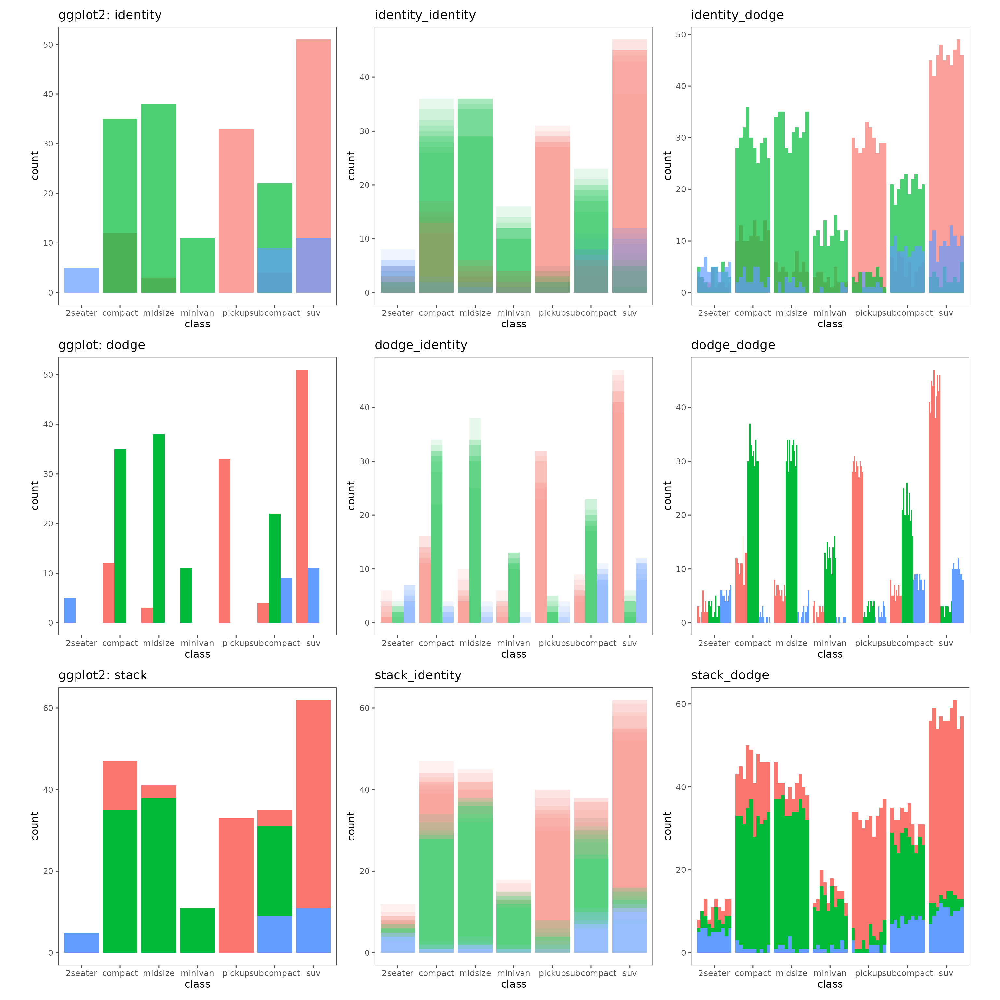

## Examples

### Working directly with model output

Sometimes you will get lucky and the modelling package you are using
will directly spit out a `distributional` objects. This is the case in a
package such as `fable`. In this case, you can literally just directly
visualise the distributions with zero pre-processing

``` r
forecast <- as_tsibble(sunspot.year) |> 
  model(ARIMA(value)) |> 
  forecast(h = "10 years") 
#> Warning: 1 error encountered for ARIMA(value)
#> [1] The `feasts` package must be installed to use this functionality. It can be installed with install.packages("feasts")

ggplot(forecast) +
  geom_line_sample(aes(x = index, y = value),
                       times=100, alpha=0.5) +
  theme_few()
#> Warning: Removed 1000 rows containing missing values or values outside the scale range
#> (`geom_line()`).
```

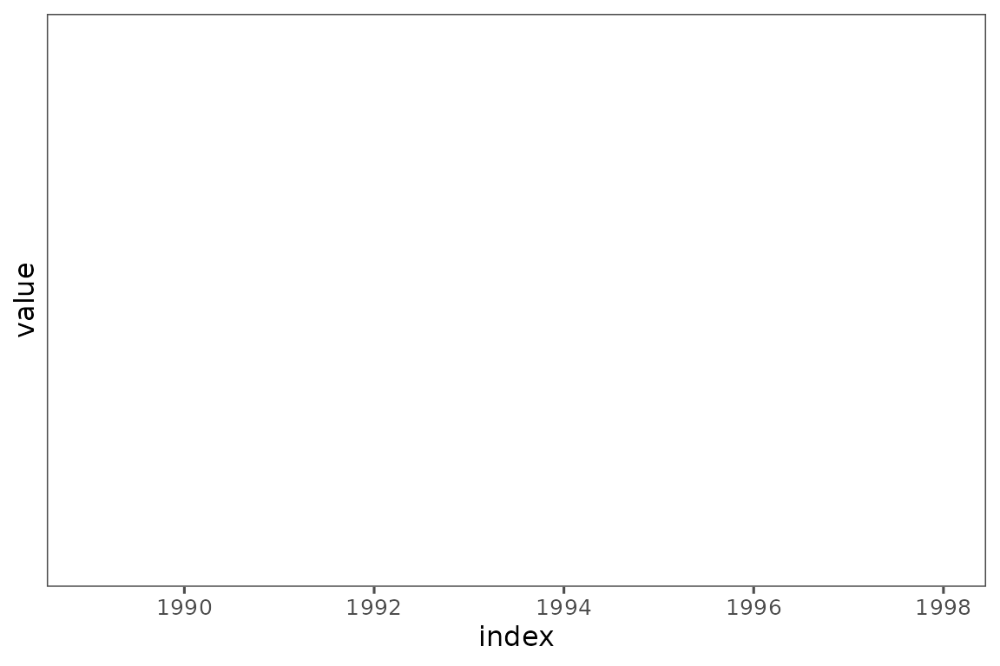

This is not a common occurrence, but when it occurs the workflow is so
seamless that uncertainty visualisation becomes as easy as visualising
regular data. The more R programs that spit out a distribution directly,
the easier it will be for you to visualise uncertainty. I cannot control
this, but hopefully being able to seamlessly visualise the distributions
will make transparency in predictions and model outputs seamless to
implement into any data analysis workflow.

### A basic `geom_abline`

The most basic estimate we can have, is the estimate for a simple linear
regression. A simple linear regression is actually used in the `ggplot2`
documentation as the example for `geom_abline`.

``` r
# plot data
p <- ggplot(mtcars, aes(wt, mpg)) + geom_point() + theme_few() 
p
```

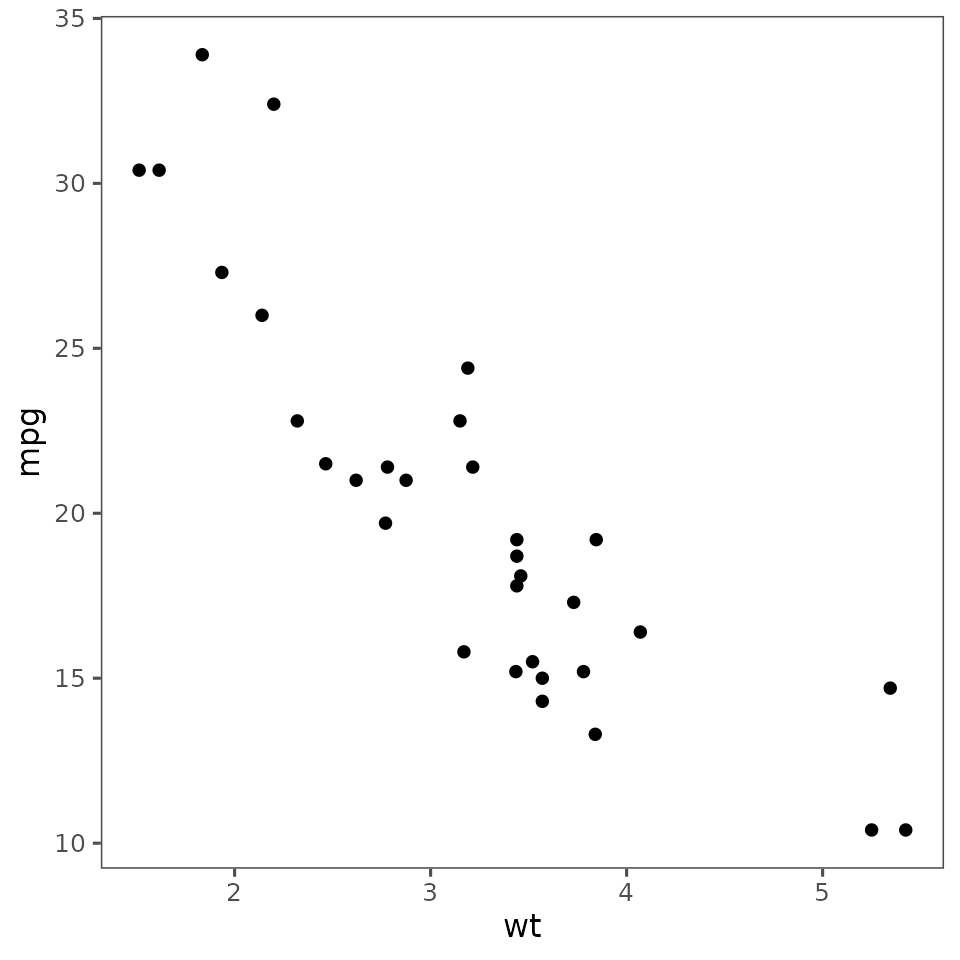

``` r
# Calculate slope and intercept of line of best fit
# get coef and standard error
summary(lm(mpg ~ wt, data = mtcars))
#> 
#> Call:
#> lm(formula = mpg ~ wt, data = mtcars)
#> 
#> Residuals:
#>     Min      1Q  Median      3Q     Max 
#> -4.5432 -2.3647 -0.1252  1.4096  6.8727 
#> 
#> Coefficients:
#>             Estimate Std. Error t value Pr(>|t|)    
#> (Intercept)  37.2851     1.8776  19.858  < 2e-16 ***
#> wt           -5.3445     0.5591  -9.559 1.29e-10 ***
#> ---
#> Signif. codes:  0 '***' 0.001 '**' 0.01 '*' 0.05 '.' 0.1 ' ' 1
#> 
#> Residual standard error: 3.046 on 30 degrees of freedom
#> Multiple R-squared:  0.7528, Adjusted R-squared:  0.7446 
#> F-statistic: 91.38 on 1 and 30 DF,  p-value: 1.294e-10
```

``` r
# ggplot, just error estimate
p1 <- p + geom_abline(intercept = 37, slope = -5)
# ggdibbler for coef AND standard error
p2 <- p + geom_abline_sample(intercept = dist_normal(37, 1.8), slope = dist_normal(-5, 0.56),
                       times=30, alpha=0.3)
p1 + p2
```

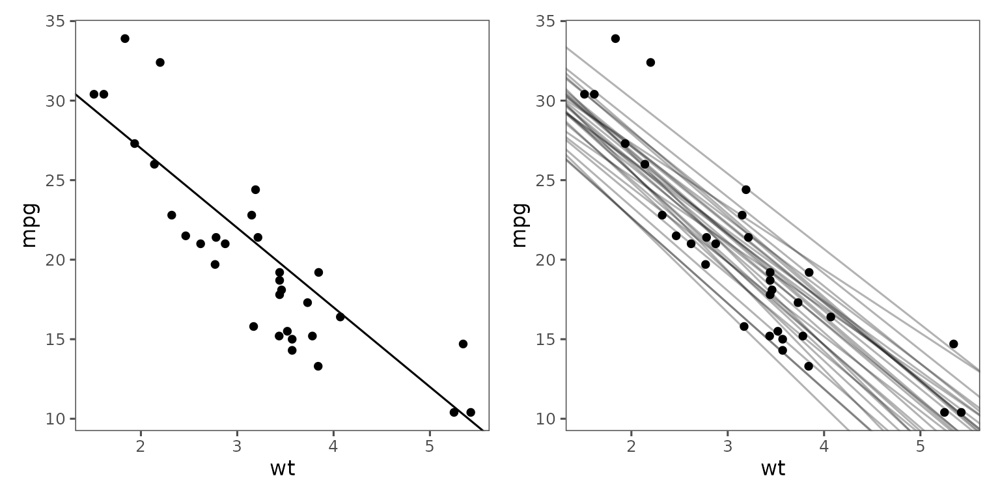

A fun aspect of this approach, is that we can simultaneously see the
impact of the variance in the intercept *and* the slope.

### A more complicated case with geom_sf

Lets work through a longer and more difficult case of uncertainty
visualisation, that involves some actual data manipulation, statistical
thinking, and a somewhat complicated visualisation; a spatial
visualisation with an uncertain fill. To look at this, we are going to
use one of the example data sets that comes with `ggdibbler`,`toy_temp`.

The `toy_temp` data set is a simulated data set that represents
observations collected from citizen scientists in several counties in
Iowa. Each county has several measurements made by individual scientists
at the same time on the same day, but their exact location is not
provided to preserve anonymity. Different counties can have different
numbers of citizen scientists and the temperature measurements can have
a significant amount of variance due to the recordings being made by
different people in slightly different locations within the county. Each
recorded temperature comes with the county the citizen scientist belongs
to, the temperature recording the made, and the scientist’s ID number.
There are also variables to define spatial elements of the county, such
as it’s geometry, and the county centroid’s longitude and latitude.

``` r
glimpse(toy_temp)
#> Rows: 990
#> Columns: 6
#> $ county_name      <chr> "Lyon County", "Dubuque County", "Crawford County", "…
#> $ county_geometry  <MULTIPOLYGON [m]> MULTIPOLYGON (((274155.2 -1..., MULTIPOL…
#> $ county_longitude <dbl> 306173.3, 746092.2, 381255.2, 696287.1, 729905.9, 306…
#> $ county_latitude  <dbl> -172880.7, -239861.5, -318675.9, -153979.0, -280551.9…
#> $ recorded_temp    <dbl> 21.08486, 28.94271, 26.39905, 27.10343, 34.20208, 20.…
#> $ scientistID      <chr> "#74991", "#22780", "#55325", "#46379", "#84259", "#9…
```

While it is slightly difficult, we can view the individual observations
by plotting them to the centroid longitude and latitude (with a little
jitter) and drawing the counties in the background for referee.

``` r
# Plot Raw Data
ggplot(toy_temp) +
  geom_sf(aes(geometry=county_geometry), fill="white") +
  ggtitle("ggdibbler some error") +
  geom_jitter(aes(x=county_longitude, y=county_latitude, colour=recorded_temp), 
              width=5000, height =5000, alpha=0.7) +
  scale_colour_distiller(palette = "OrRd") +
  theme_map()
```

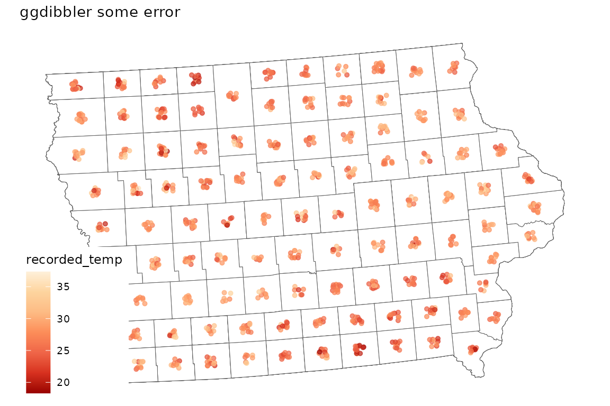

Typically, we would not visualise the data this way. A much more common
approach would be to take the average of each county and display that in
a choropleth map, displayed below.

``` r
# Mean data
toy_temp_mean <- toy_temp |> 
  group_by(county_name) |>
  summarise(temp_mean = mean(recorded_temp)) 
  
# Plot Mean Data
ggplot(toy_temp_mean) +
  ggtitle("ggdibbler some error")+
  scale_fill_distiller(palette = "OrRd") +
  geom_sf(aes(geometry=county_geometry, fill=temp_mean), colour="white") +
  theme_map()
```

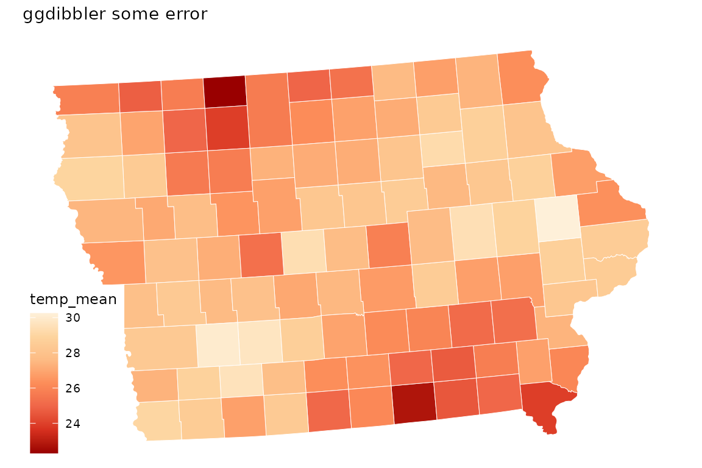

This plot is fine, but it does loose a key piece of information,
specifically the understanding that this mean is an estimate. That means
that this estimate has a sampling distribution that is invisible to us
when we make this visualisation.

We can see that there is a wave like pattern in the data, but sometimes
spatial patterns are not the result of significant differences in
population, and may disappear if we were to include the variance of the
estimates. We can calculate the estimated standard error alongside the
mean.

``` r
# Mean and variance data
toy_temp_est <- toy_temp |> 
  group_by(county_name) |>
  summarise(temp_mean = mean(recorded_temp),
            temp_se = sd(recorded_temp)/sqrt(n())) 
```

Getting an estimate along with its variance is also a common format
governments supply data. Just like in our citizen scientist case, this
if often done to preserve anonymity.

The problem with this format of data, is that there is no way for us to
include the variance information in the visualisation. We can only
visualise the estimate and its variance separately. So, instead of
trying to use the estimate and its variance as different values, we
combine them as a single distribution variable.

``` r
# Distribution
toy_temp_dist <- toy_temp_est |> 
  mutate(temp_dist = dist_normal(temp_mean, temp_se)) |>
  select(county_name, temp_dist) 

# Plot Distribution Data
ggplot(toy_temp_dist) +
  geom_sf_sample(aes(geometry=county_geometry, fill=temp_dist), 
                 times=50, linewidth=0) +
  scale_fill_distiller(palette = "OrRd")  +
  theme_map()
```

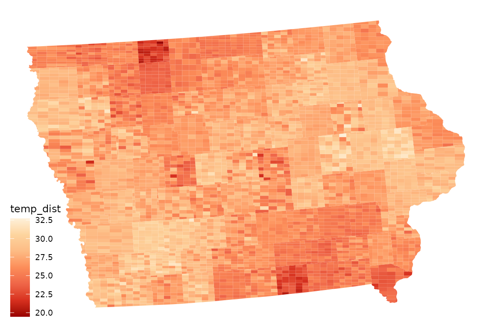

To maintain flexibility, the `geom_sf_sample` does not highlight the
original boundary lines, but that can be easily added just by adding
another layer.

``` r
ggplot(toy_temp_dist) + 
  geom_sf_sample(aes(geometry = county_geometry, fill=temp_dist), 
                 linewidth=0, times=50) + 
  scale_fill_distiller(palette = "OrRd") +
  geom_sf(aes(geometry = county_geometry), 
          fill=NA, linewidth=1, colour="white") +
  theme_map()
```

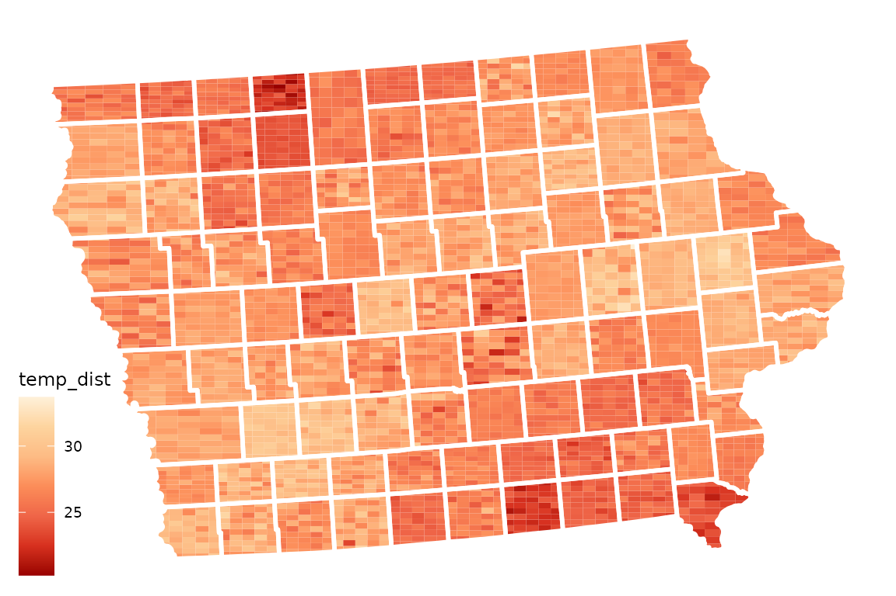

By default, `geom_sf_sample` will subdivide the data. It is unlikely
that you will ever notice this default, as the random part in a geom_sf
is almost always the fill, but in the unlikely event the random object
is the SF part, you will need to change the position to `"identity"` and
use `alpha` to manage over plotting. Alternatively, making an animated
plot (detailed below) also requires the position to be changed to
`"identity"`. Note that unlike `geom_sf_sample`, `geom_polygon_sample`
does not have subdivide turned on by default.

Subdivide is the only position that is specifically created for
`ggdibbler`. It was inspired by the pixel map used in
[`Vizumap`](https://github.com/lydialucchesi/Vizumap). All the other
position systems used are nested versions of the existing `ggplot2`
positions.

### What about animated plots?

Yup, you can do that too. It’s actually very simple. [Hypothetical
outcome](chrome-extension://efaidnbmnnnibpcajpcglclefindmkaj/https://idl.cs.washington.edu/files/2015-HOPs-PLOS.pdf)
plots have been suggested as an uncertainty visualisation technique, and
they are also easily implemented in `ggdibbler`.

In a HOPs plot, it seems that animations replace our distribution
specific position adjustment and the continuous mapping theorem still
holds. As the variance of each random variable approaches 0, the
difference between the frames approaches zero until the animation looks
like a single static plot.

Implementing the code is trivially easy when we just have the animation
run through every draw using the `drawID` variable (which is exactly
what we do in the other position adjustments).

``` r
# bar chart
hops <- ggplot(uncertain_mpg, aes(class)) +
  geom_bar_sample(aes(fill = drv),
                  position = "stack_identity", times=30) +
  theme_few() +
  transition_states(after_stat(drawID))

animate(hops, renderer =  gifski_renderer())
```

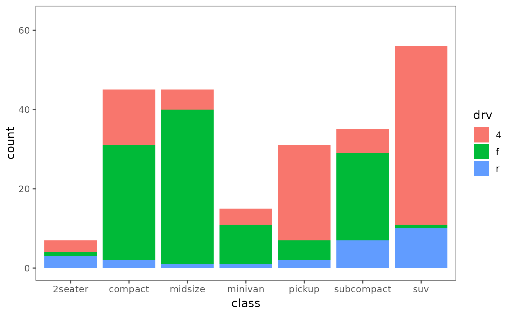

### What if my plot uses ggplot2 extensions?

If you represent uncertainty as a distributional object, use the
`sample_expand` function, and group by `drawID`, you can apply the
signal suppression methods to literally any graphic. It won’t always
work as nicely as `ggdibbler` (please download the package, it looks
good on my CV and I need a job) and you can’t use the nested position
system, but it works well enough. Writing extensions that use
`ggdibbler` is covered in a separate vignette.

This section will go through an example with `ggraph` and uncertain
edges. So you have this random data set.

``` r
set.seed(10)
uncertain_edges <- tibble::tibble(from = sample(5, 20, TRUE),
                    to = sample(5, 20, TRUE),
                    weight = runif(20)) |>
  dplyr::group_by(from, to) |>
  dplyr::mutate(to = distributional::dist_sample(list(sample(seq(from=max(1,to-1), 
                                                 to = min(to+1, 5)), 
                                      replace = TRUE)))) |>
  ungroup()
  
head(uncertain_edges)
#> # A tibble: 6 × 3
#>    from        to weight
#>   <int>    <dist>  <dbl>
#> 1     3 sample[3] 0.761 
#> 2     1 sample[2] 0.573 
#> 3     2 sample[3] 0.448 
#> 4     4 sample[3] 0.0838
#> 5     3 sample[2] 0.219 
#> 6     2 sample[3] 0.0756
```

You need to apply `sample_expand` before you convert the data to a
graph, because `ggraph` is all totalitarian about what it will keep in
its graph data set, and it doesn’t allow distributions.

``` r
graph_sample <- uncertain_edges |>
  sample_expand(times=50) |>
  as_tbl_graph()
```

Now, the ideal visualisation would allow us to add transparency with a
small amount of jitter to straight lines. That doesn’t seem to be
possible in `ggraph` (as far as I can tell). It seems that, similar to
`ggplot2`, the lines are actually made up of many individual points, and
the line geometry simply interpolates between them. When it applies the
jitter, it does it to each point, rather than the line as a whole. So,
adding the jitter does work, it just doesn’t work exactly as you might
expect. It does produce an uncertainty visualisation, though.

``` r
jitter = position_jitter(width=0.01, height=0.01)
ggraph(graph_sample, layout = 'fr', weights = weight) + 
  geom_edge_link(aes(group=drawID), position=jitter, alpha=0.1, 
                 linewidth=0.05) + 
  geom_node_point(size=5)
```

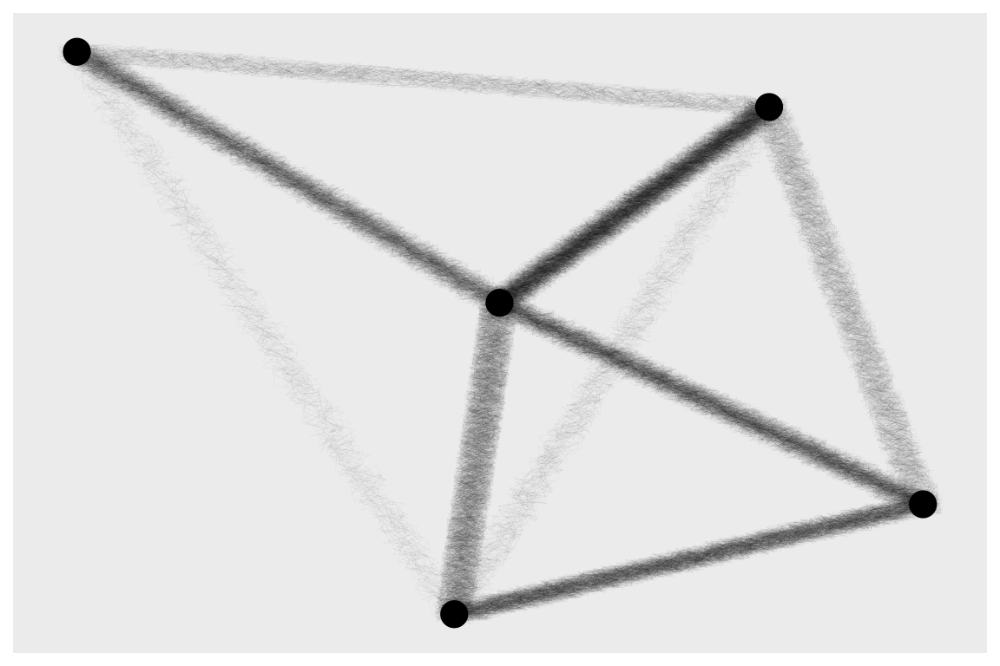

You can mess around with alpha, linewidth, and the times argument in the
`sample_expand` function to get something you are happy with. There are
some other weird over plotting edge things you can utilise to make the
uncertainty implicitly represented by some other aesthetic (like
thickness), but in general the approaches all look similar (and convey
similar information)

``` r
# uncertainty indicated by transparency
ggraph(graph_sample, layout = 'fr', weights = weight) + 
  geom_edge_link(aes(group=drawID), alpha=0.005,
                 linewidth=2) + 
  geom_node_point()
```

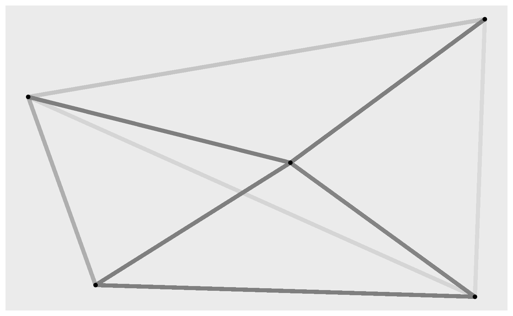

``` r

# Thickness = probability of an edge (thicker = more probable)
ggraph(graph_sample, layout = 'fr', weights = weight) + 
  geom_edge_parallel0(aes(group=drawID),
                      sep = unit(0.05, "mm"), alpha=0.3, linewidth=0.1) + 
  geom_node_point(size=15)
```


