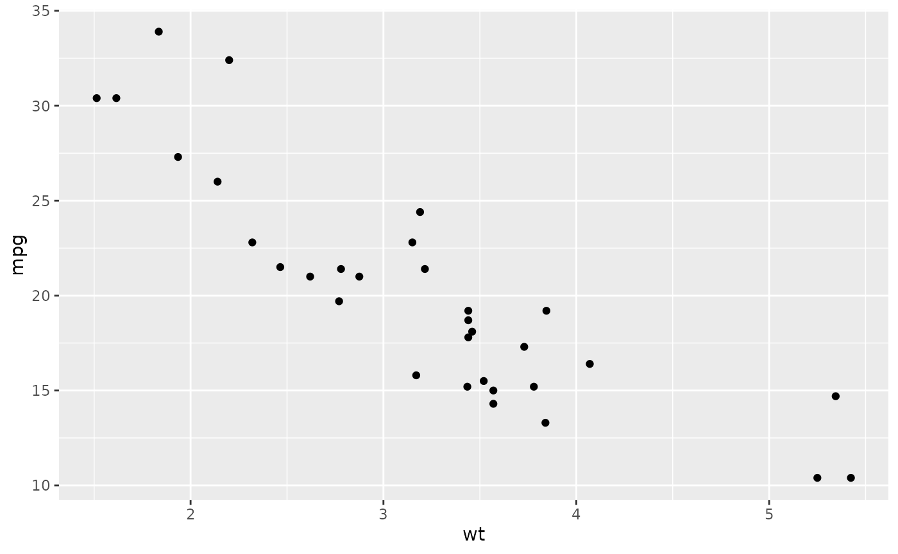
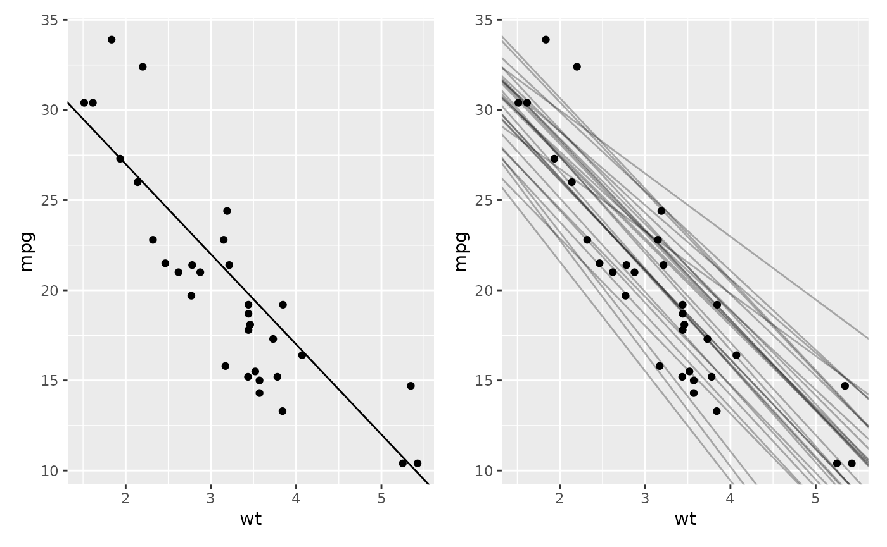
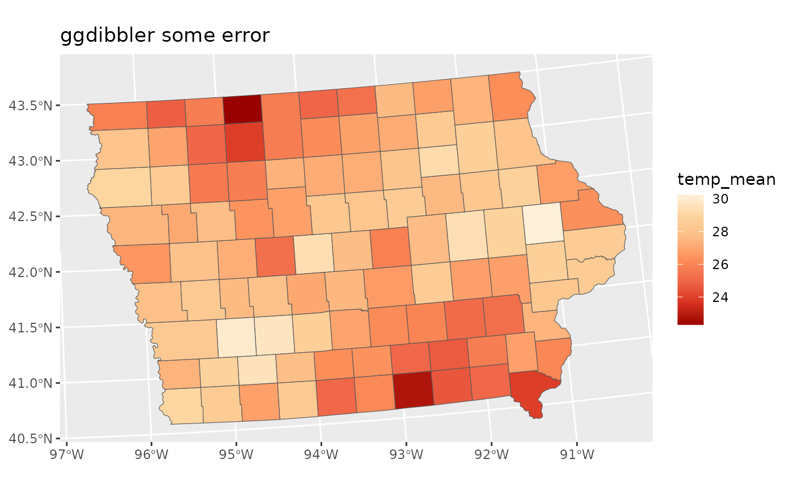
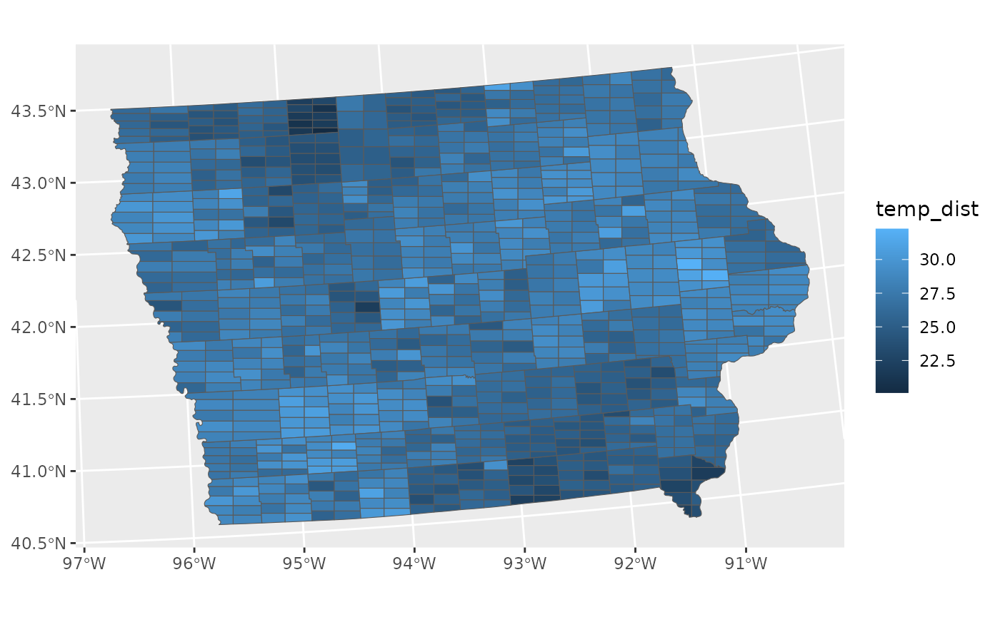
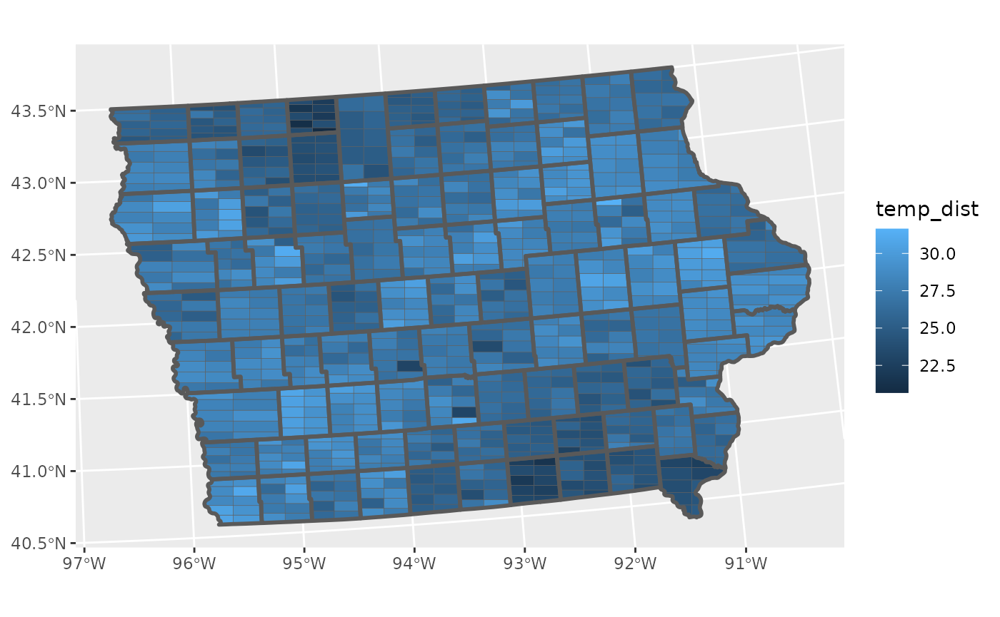

# An introduction to ggdibbler

## Why use `ggdibbler`?

It may not be obvious from the outset why we would want this package,
after all, there are plenty of geoms and plenty of ways to visualise
distributions, so what is the point of this?

For information to be passed into ggplot2, or any visualisation
software, it usually needs to be expressed as data. This restriction
prevents us from visualising inputs that are too uncertain to be
expressed as single data values. This can include things like estimates,
model predictions, bounded values or observations with large measurement
error.

Now, users can simply replace a vector of data with a vector of random
variables created using
[`distributional`](https://github.com/mitchelloharawild/distributional)
and visualise these types of inputs using `ggdibbler`. Any quantifiable
uncertainty can be expressed as a distribution, and any distribution can
be passed to an existing ggplot2 geom with ggdibbler. Users are not
limited by data type (the data can be a random factor, continuous
variable, character, etc) or by type of distribution (it can be any
theoretical distribution, but also an empirical distribution expressed
as a set of samples).

`ggdibbler` incorporates uncertainty into your graphic as noise and
allows you to see how the variation may change the conclusions you take
away from your graphics. The power of ggdibbler is in its simplicity and
flexibility. There is no need to learn specific package syntax or new
functions and you can pass a distribution to ANY combination of
aesthetics in ggplot2.

The value of `ggdibbler` becomes aparent when we look at a use cases for
the software.

## Visualising uncertainty as a function of a plot

If you have taken a look at any `ggdibbler`, documentation, you may have
noticed that it is a replica of the `ggplot2` documentation, right down
to the examples. (Almost) every dataset used in a `ggplot2` example has
a `ggdibbler` equivalent, every `geom_*` and `stat_*` is replicated with
a `geom_*_sample` and `stat_*_sample` function respectively. We
repeatedly show uncertain plots alongside their certain counterparts.

The philosophy of `ggdibbler` is that there is no such thing as an
uncertainty visualisation (despite us using the phrase repeatedly in the
documentation), at least not in isolation. Uncertainty visualisation is
the process of incorporating uncertainty into the graphic, such that we
can see how that uncertainty changes the take away messages of the plot.
Every `ggdibbler` visualisation should have a `ggdplot2` comparison, and
vice-versa. This is why the `ggdibbler` examples, function, and data are
presented as they are. It is to show what a plot looks like if you
replace every single variable with a random variable. Sometimes this
makes the dataset a little odd, e.g. why would we be uncertain about
literally every single variable in `mtcars`.

``` r
head(mtcars[,1:3])
#>                    mpg cyl disp
#> Mazda RX4         21.0   6  160
#> Mazda RX4 Wag     21.0   6  160
#> Datsun 710        22.8   4  108
#> Hornet 4 Drive    21.4   6  258
#> Hornet Sportabout 18.7   8  360
#> Valiant           18.1   6  225
head(uncertain_mtcars[,1:3])
#> # A tibble: 6 × 3
#>         mpg
#>      <dist>
#> 1 U(20, 22)
#> 2 U(21, 21)
#> 3 U(22, 24)
#> 4 U(21, 22)
#> 5 U(17, 20)
#> 6 U(17, 19)
#> # ℹ 2 more variables: cyl <dist>, disp <dist>
```

But the data sets are more… illustrative than practical. Hopefully what
the data examples lack in sense, they make up for in exploration, as you
can use `ggdibbler` to investigate the (sometimes questionable) ways
added uncertainty to the variables. The examples section of this
vignette has more practical examples so you can see how the package
actually works in practice.

## Using distributional

`ggdibbler` is entirely built upon the R package `distributional` which
allows you to store distributions in a `tibble` as distribution objects.
I had literally nothing to do with the package, Mitch, Matt, Alex and
Rob have my eternal gratitude for writing it, but it met almost all my
needs when it came to building `ggdibbler`. If you have a case of
uncertainty you want to represent, I would seriously suggest having a
poke around in distributional documentation. It is shockingly flexible
and I am yet to come across a case of uncertainty *cannot* be
represented by `distributional`.

- Bounded values? use `dist_uniform(lowerbound, upperbound)`
- Uncertain predicted classes? use `dist_categorical`
- Want to sample values from a specific vector of values (such as a
  posterior)? use `dist_sample`

If you have an uncertainty that can be expressed numerically (which is
unfortunately the most basic prerequisite for plotting anything, not
just uncertainty) then it can almost certainly be captured with a
distribution.

All of the data sets in `ggdibbler` already have the distributional
component added, but making a distribution vector is shockingly easy.
Below is an example where we make normally distributed estimates by
wrapping our typical estimate and standard error calculations in a
`dist_normal` function.

``` r
toy_temp_eg <- toy_temp |> 
  group_by(county_name) |>
  summarise(temp_dist = dist_normal(mu = mean(recorded_temp),
                                    sigma = sd(recorded_temp)/sqrt(n())))

print(head(toy_temp_eg))
#> Simple feature collection with 6 features and 2 fields
#> Geometry type: MULTIPOLYGON
#> Dimension:     XY
#> Bounding box:  xmin: 406217.2 ymin: -466551.1 xmax: 722461.8 ymax: -128604.1
#> Projected CRS: NAD27 / US National Atlas Equal Area
#> # A tibble: 6 × 3
#>   county_name    temp_dist
#>   <chr>             <dist>
#> 1 Adair County N(30, 0.82)
#> 2 Adams County    N(30, 1)
#> 3 Allamakee C…  N(26, 0.3)
#> 4 Appanoose C… N(23, 0.69)
#> 5 Audubon Cou…  N(28, 0.8)
#> 6 Benton Coun…    N(29, 2)
#> # ℹ 1 more variable: county_geometry <MULTIPOLYGON [m]>
```

There are also flexibilities that go beyond just the distribution you
choose.

- You can transform distributions using `dist_transformed` or make your
  own distributions if you want (although I am not sure how difficult
  that is, I have never had to do it).

- You can also mix different distributions together (all the
  distributions in a variable don’t need to be the same family)

- You can have deterministic (there is a deterministic distribution) and
  distributional objects in the same column.

We will now go onto the `ggdibbler` specific examples (this is not the
distributional vignette) but it is definitely worth having a play around
in `distributional` so you understand the object before jumping straight
into `ggdibbler` plots.

## Examples

### A basic `geom_abline`

The most basic estimate we can have, is the estimate for a simple linear
regression. A simple linear regression is actually used in the `ggplot2`
documentation as the example for `geom_abline`.

``` r
# plot data
p <- ggplot(mtcars, aes(wt, mpg)) + geom_point()
p
```



``` r
# Calculate slope and intercept of line of best fit
# get coef and standard error
summary(lm(mpg ~ wt, data = mtcars))
#> 
#> Call:
#> lm(formula = mpg ~ wt, data = mtcars)
#> 
#> Residuals:
#>     Min      1Q  Median      3Q     Max 
#> -4.5432 -2.3647 -0.1252  1.4096  6.8727 
#> 
#> Coefficients:
#>             Estimate Std. Error t value Pr(>|t|)    
#> (Intercept)  37.2851     1.8776  19.858  < 2e-16 ***
#> wt           -5.3445     0.5591  -9.559 1.29e-10 ***
#> ---
#> Signif. codes:  0 '***' 0.001 '**' 0.01 '*' 0.05 '.' 0.1 ' ' 1
#> 
#> Residual standard error: 3.046 on 30 degrees of freedom
#> Multiple R-squared:  0.7528, Adjusted R-squared:  0.7446 
#> F-statistic: 91.38 on 1 and 30 DF,  p-value: 1.294e-10
```

``` r
# ggplot, just error estimate
p1 <- p + geom_abline(intercept = 37, slope = -5)
# ggdibbler for coef AND standard error
p2 <- p + geom_abline_sample(intercept = dist_normal(37, 1.8), slope = dist_normal(-5, 0.56),
                       times=30, alpha=0.3)
p1 + p2
```



A fun aspect of this approach, is that we can simultaneously see the
impact of the variance in the intercept *and* the wt coefficient.

### A more complicated geom_sf

Ok, I am bored, one simple example is. Lets work through a longer and
more difficult case of uncertainty visualisation, a spatial
visualisation with an uncertain fill. To look at this, we are going to
use one of the example data sets that comes with `ggdibbler`,`toy_temp`.

The `toy_temp` data set is a simulated data set that represents
observations collected from citizen scientists in several counties in
Iowa. Each county has several measurements made by individual scientists
at the same time on the same day, but their exact location is not
provided to preserve anonymity. Different counties can have different
numbers of citizen scientists and the temperature measurements can have
a significant amount of variance due to the recordings being made by
different people in slightly different locations within the county. Each
recorded temperature comes with the county the citizen scientist belongs
to, the temperature recording the made, and the scientist’s ID number.
There are also variables to define spatial elements of the county, such
as it’s geometry, and the county centroid’s longitude and latitude.

``` r
glimpse(toy_temp)
#> Rows: 990
#> Columns: 6
#> $ county_name      <chr> "Lyon County", "Dubuque County", "Crawford County", "…
#> $ county_geometry  <MULTIPOLYGON [m]> MULTIPOLYGON (((274155.2 -1..., MULTIPOL…
#> $ county_longitude <dbl> 306173.3, 746092.2, 381255.2, 696287.1, 729905.9, 306…
#> $ county_latitude  <dbl> -172880.7, -239861.5, -318675.9, -153979.0, -280551.9…
#> $ recorded_temp    <dbl> 21.08486, 28.94271, 26.39905, 27.10343, 34.20208, 20.…
#> $ scientistID      <chr> "#74991", "#22780", "#55325", "#46379", "#84259", "#9…
```

While it is slightly difficult, we can view the individual observations
by plotting them to the centroid longitude and latitude (with a little
jitter) and drawing the counties in the background for referece.

``` r
# Plot Raw Data
ggplot(toy_temp) +
  geom_sf(aes(geometry=county_geometry)) +
  geom_jitter(aes(x=county_longitude, y=county_latitude, colour=recorded_temp), 
              width=5000, height =5000, alpha=0.7)
```


Typically, we would not visualise the data this way. A much more common
approach would be to take the average of each county and display that in
a choropleth map, displayed below.

``` r
# Mean data
toy_temp_mean <- toy_temp |> 
  group_by(county_name) |>
  summarise(temp_mean = mean(recorded_temp)) 
  
# Plot Mean Data
ggplot(toy_temp_mean) +
  geom_sf(aes(geometry=county_geometry, fill=temp_mean))
```



This plot is fine, but it does loose a key piece of information,
specifically the understanding that this mean is an estimate. That means
that this estimate has a sampling distribuiton that is invisible to us
when we make this visualisation.

We can see that there is a wave like pattern in the data, but sometimes
spatial patterns are a result of significant differences in population,
and may disappear if we were to include the variance of the estimates,
we can calculate that with the average.

``` r
# Mean and variance data
toy_temp_est <- toy_temp |> 
  group_by(county_name) |>
  summarise(temp_mean = mean(recorded_temp),
            temp_se = sd(recorded_temp)/sqrt(n())) 
```

Getting an estimate along with its variance is also a common format
governments supply data. Just like in our citizen scientist case, this
if often done to preserve anonymity.

The problem with this format of data, is that there is no way for us to
include the variance information in the visualisation. We can only
visualise the estimate and its variance separately. So, instead of
trying to use the estimate and its variance as different values, we
combine them as a single distribution variable thanks to the
`distributional` package and then can use it with the `ggdibbler`
version of `geom_sf`, `geom_sf_sample`.

``` r
# Distribution
toy_temp_dist <- toy_temp_est |> 
  mutate(temp_dist = dist_normal(temp_mean, temp_se)) |>
  select(county_name, temp_dist) 

# Plot Distribution Data
ggplot(toy_temp_dist) +
  geom_sf_sample(aes(geometry=county_geometry, fill=temp_dist)) 
```



To maintain flexibility, the `geom_sf_sample` does not highlight the
original boundary lines, but that can be easily added just by adding
another layer.

``` r
ggplot(toy_temp_dist) + 
  geom_sf_sample(aes(geometry = county_geometry, fill=temp_dist), linewidth=0.1) + 
  geom_sf(aes(geometry = county_geometry), fill=NA, linewidth=1) 
```



Currently `geom_sf` only accepts a random fill, as it subdivides the
geometry to fill it with a sample. This will eventually be extended to
all the `geom_sf` aesthetics (which is the case for all other geometries
in `ggdibbler`)

## Limitations of the Package

There are three primary limitations of the software to keep in mind.
First, it only allows you to visualise the distribution as a sample. We
are planning to expand this to quantiles in later version, but it is not
currently an option. Second, if multiple distributions are passed, they
are assumed to be independent. This is also something we are hoping to
fix in later versions (possibly with a covariance matrix or a dibble
object that represents joint distributions). Finally, replacing a single
value with a sample of values (which is functionally what ggdibbler
does) results in pervasive overplotting issue. We are hoping to mediate
this with nested positions and sensible geom defaults, but this can be
difficult to manage depending on the type of plot. In general, we
recommend *always* setting `alpha<=0.5` the first time you make a plot.
