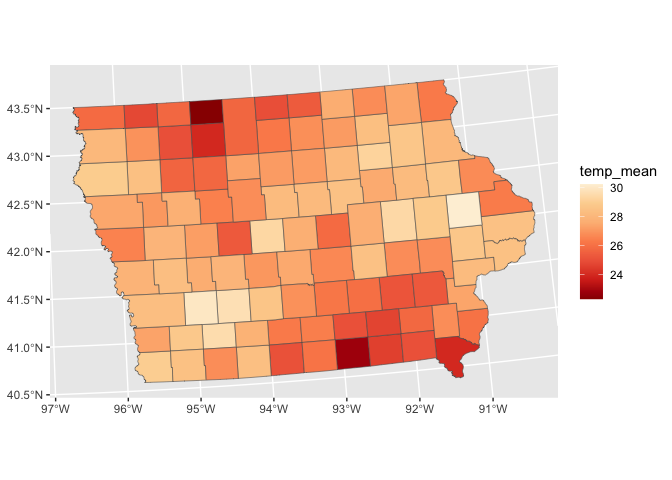

# ggdibbler

For information to be passed into ggplot2, or any visualisation
software, it usually needs to be expressed as data. This restriction
prevents us from visualising inputs that are too uncertain to be
expressed as single data values. This can include things like estimates,
model predictions, bounded values or observations with large measurement
error.

Now, users can simply replace a vector of data with a vector of random
variables created using
[`distributional`](https://github.com/mitchelloharawild/distributional)
and visualise these types of inputs using `ggdibbler`. Any quantifiable
uncertainty can be expressed as a distribution, and any distribution can
be passed to an existing ggplot2 geom with ggdibbler. Users are not
limited by data type (the data can be a random factor, continuous
variable, character, etc) or by type of distribution (it can be any
theoretical distribution, but also an empirical distribution expressed
as a set of samples).

`ggdibbler` it incorporates uncertainty into your graphic as noise and
allows you to see how the variation may change the conclusions you take
away from your graphics. The power of ggdibbler is in its simplicity and
flexibility. There is no need to learn specific package syntax or new
functions and you can pass a distribution to ANY combination of
aesthetics in ggplot2.

## Installation

You can install the stable version of `ggdibbler` from CRAN with:

``` r
# install.packages("pak")
install.packages("ggdibbler")
```

or you can install the development version of ggdibbler from
[GitHub](https://github.com/) with:

``` r
# install.packages("pak")
pak::pak("harriet-mason/ggdibbler")
```

## Examples

In essence, `ggdibbler` makes visualising uncertainty easy, as you just
replace the `geom_*` with `geom_*_sample` and replace your deterministic
variable with a `distributional` variable, and you get an uncertainty
visualisation.

Uncertainty visualisation, under this approach, is seen as a function of
an existing plot. Below are some examples of `ggplot2` code alongside
its uncertain `ggdibbler` counterpart. The only parameter added by
`ggdibbler` is the `times` argument, which decides how many samples to
draw from the distribution.

``` r
library(distributional)
library(dplyr)
library(sf)
library(ggplot2)
library(ggdibbler)
library(patchwork)

set.seed(1343)
```

``` r
recent <- economics[economics$date > as.Date("2013-01-01"), ]
uncertain_recent <- uncertain_economics[uncertain_economics$date > as.Date("2013-01-01"), ]
p1 <- ggplot(recent, aes(date, unemploy)) + geom_step() +
  ggtitle("ggplot2")
p2 <- ggplot(uncertain_recent, aes(date, unemploy)) + geom_step_sample(alpha=0.2) +
  ggtitle("ggdibbler")
p1 + p2
```



``` r
# Make average summary of data
toy_temp_mean <- toy_temp |> 
  dplyr::group_by(county_name) |>
  summarise(temp_mean = mean(recorded_temp))

# plot it
p1 <- ggplot(toy_temp_mean) +
  geom_sf(aes(geometry=county_geometry, fill=temp_mean), linewidth=0.7) +
  scale_fill_distiller(palette = "OrRd") +
  labs(fill="temp")+
  ggtitle("ggplot2")+
  theme(legend.position = "bottom")

# sample map
p2 <- toy_temp_dist |> 
  ggplot() + 
  geom_sf_sample(aes(geometry = county_geometry, fill=temp_dist), linewidth=0) + 
  geom_sf(aes(geometry = county_geometry), fill=NA, linewidth=0.7) +
  scale_fill_distiller(palette = "OrRd") +
  labs(fill="temp")+
  ggtitle("ggdibbler")+
  theme(legend.position = "bottom")

p1+p2
```


If you pass random variables to aesthetics like colour or label, but not
position aesthetics such as x or y, you might want to add a jitter or
adjust the alpha value so that you can see all outcomes of the
distribution. Otherwise you will only see the final layer.

``` r
point_data <- data.frame(x = c(1,2,3),
                         y = c(2,5,7),
                         certain_class = c("A", "B", "C"),
                         uncertain_class = dist_categorical(prob = list(c(0.8,0.15,0.05),
                                                                      c(0.25,0.7,0.05),
                                                                      c(0.25,0,0.75)),
                                                          outcomes = list(c("A", "B", "C"))))
p1 <- ggplot(data = point_data, aes(x,y)) + 
  geom_point(aes(colour = certain_class), size=5)+
  ggtitle("ggplot2")+
  theme(legend.position = "bottom")
  
p2 <- ggplot(data = point_data, aes(x,y)) + 
  geom_point_sample(aes(colour = uncertain_class), size=1, times=30,
                    position = position_jitter(width=0.1, height=0.2))+
  ggtitle("ggdibbler")+
  theme(legend.position = "bottom")

p1 + p2
```


Finally, lets see a case where the uncertainty (standard error in this
example) actually is high enough to change the conclusions we take from
the visualisation.

``` r

p1 <- ggplot(faithfuld, aes(waiting, eruptions)) + 
  geom_raster(aes(fill = density)) +
  ggtitle("ggplot2")+
  theme(legend.position = "bottom")

p2 <- ggplot(uncertain_faithfuld, aes(waiting, eruptions)) + 
  geom_raster_sample(aes(fill = density)) +
  ggtitle("ggdibbler low SE")+
  theme(legend.position = "bottom")

p3 <- ggplot(uncertain_faithfuld, aes(waiting, eruptions)) + 
  geom_raster_sample(aes(fill = density2)) +
  ggtitle("ggdibbler high SE")+
  theme(legend.position = "bottom")

p1  + p2 + p3
```


## Limitations

There are three primary limitations of the software to keep in mind.
First, it only allows you to visualise the distribution as a sample. We
are planning to expand this to quantiles in later version, but it is not
currently an option. Second, if multiple distributions are passed, they
are assumed to be independent. This is also something we are hoping to
fix in later versions (possibly with a covariance matrix or a dibble
object that represents joint distributions). Finally, replacing a single
value with a sample of values (which is functionally what ggdibbler
does) results in pervasive overplotting issue. We are hoping to mediate
this with nested positions and sensible geom defaults, but this can be
difficult to manage depending on the type of plot. In general, we
recommend *always* setting `alpha<=0.5` the first time you make a plot.

## Future additions to the package

The eventual goal of `ggdibbler` is to allows any distribution object to
be passed to any aesthetic in a `ggplot2` geom (so long as I have gotten
to that geom). The main improvements that are currently being made are
working through the full set of `ggplot2` geometries, the status of
which is tracked in the [All Geometries - Status
List](https://github.com/harriet-mason/ggdibbler/issues/28) issue,
implementing nested positions, which is tracked in the [All Nested
Positions - Status
list](https://github.com/harriet-mason/ggdibbler/issues/34) issue, and
allowing users to represent distributions as quantiles instead of
samples.
